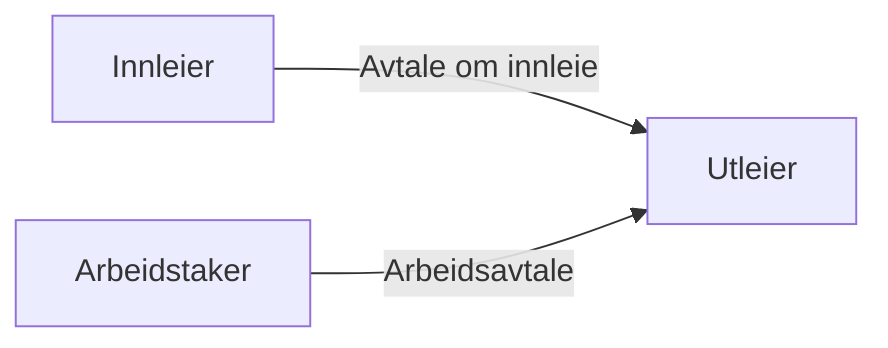
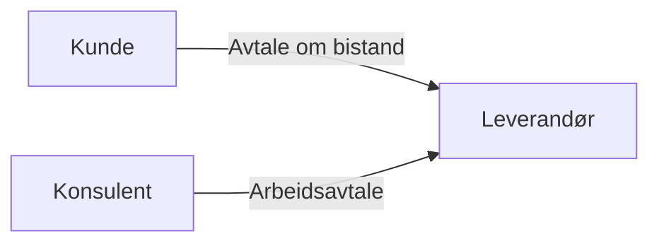
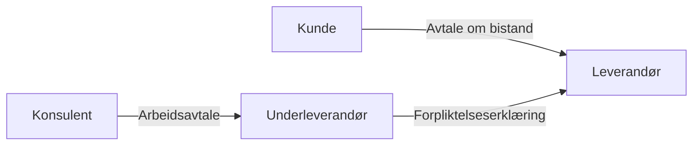

# Det nye regelverket for innleie

**TL;DR**: Fra 1. januar 2024 må alle virksomheter som driver med utleie av arbeidskraft i Norge godkjennes av Arbeidstilsynet. Kun virksomheter som får godkjenning kan lovlig leie ut arbeidstakere. Selvstendig næringsdrivende får ikke godkjenning. Dette har ført til at selvstendige IT-konsulenter nå stenges ute fra store deler av markedet. Dette dokumentet er en "primer" som tilgjengeliggjør og forklarer denne problematikken.

Målgruppen for denne teksten er selvstendige konsulenter, journalister, politikere og andre som ønsker å orientere seg om saken. Bidrag og korreksjoner er velkomne (se [Contributing.md](CONTRIBUTING.md)).

# Bakgrunn

Fra og med 1. april 2023 trådte det i kraft et nytt regelverk i Norge som påvirker innleie fra bemanningsforetak. Dette regelverket var en del av en bredere innsats for å stramme inn bruken av midlertidige ansettelser og innleie fra bemanningsbyråer, med mål om å sikre bedre arbeidsvilkår for arbeidstakere og gjøre fast ansettelse til hovedregelen. Regelverket ble vedtatt gjennom [proposisjon 131 til Stortinget](https://www.regjeringen.no/no/dokumenter/prop.-131-l-20212022/id2919207/).

Regelverket har både før og etter innføringen blitt kritisert for manglende konsekvensutredninger, mangel på tydelighet, misforståelser og negative konsekvenser for selvstendig næringsdrivende. 

## Hva er innleie

I følge [Lovdata](https://lovdata.no/lov/2005-06-17-62/§14-12) defineres innleie som følger:
> Ved vurderingen av om en oppdragsavtale mellom to virksomheter innebærer innleie, skal det særlig legges vekt på om oppdragsgiver har ledelsen av arbeidet og ansvar for resultatet.

I tillegg har [Arbeidstilsynet oppgitt disse kriteriene](https://www.arbeidstilsynet.no/arbeidsforhold/ansettelse/innleie/):

> Dersom det er tvilsomt hvem som har ledelsen av arbeidet og ansvar for resultatet, taler følgende momenter for innleie, om:
> * Det i hovedsak leveres arbeidskraft
> * Arbeidet skjer i nær tilknytning til oppdragsgivers virksomhet
> * Arbeidet dekker et vedvarende arbeidskraftbehov hos oppdragsgiver
> * Arbeidet skjer innenfor oppdragsgivers kjerne- eller hovedaktivitet

Ved innleie er arbeidstakeren ansatt i en utleievirksomhet, mens selve arbeidet utføres under ledelse av innleievirksomheten. Sammenlignet med vanlige arbeidsforhold innebærer innleie dermed et trepartsforhold:

## Når kan man leie inn arbeidstakere

Som hovedregel er det kun lovlig å leie inn arbeidstakere i disse tilfellene:

* For arbeid i stedet for en annen (vikariat)
* Avtale om tidsbegrenset innleie fra bemanningsforetak med skriftlig avtale med bedriftens tillitsvalgte
* Midlertidig behov for spesialkompetanse innenfor rådgivnings- og konsulenttjenester
* Behov for helsepersonell for å sikre forsvarlig drift av helse- og omsorgstjenester

I alle tilfellene kan man kun leie inn arbeidstakere fra enten et godkjent bemanningsforetak eller en produksjonsbedrift som oppfyller kravene.

Du kan lese mer om dette hos [Arbeidstilsynet](https://www.arbeidstilsynet.no/arbeidsforhold/ansettelse/innleie/).

## Hva er kjøp av konsulenttjenester

I følge [DigDir's veileder for kjøp av konsulenttjenester](https://anskaffelser.no/sites/default/files/difi_veileder_konsulenttjenester.pdf):

> En offentlig anskaffelse av en konsulenttjeneste er en tjenesteanskaffelse og følger reglene for denne type anskaffelser. Typiske kjennetegn for en konsulenttjeneste er at:
> * Tjenesten i stor grad handler om personbaserte ytelser og avhenger av personers kunnskaper, erfaring og ferdigheter
> * Kvaliteten på tjenesten avhenger både av enkeltpersoners kunnskap og kompetanse, men også av konsulentselskapets faglige metodikk og kvalitetssikringsrutiner
> * Leveransen ofte forutsetter en viss grad  av samhandling mellom leverandør  og oppdragsgiver

I dette tilfellet foreligger det dermed også et trepartsforhold:

For selvstendige konsulenter vil det dog ofte være et firepartsforhold:

Her har ikke underleverandøren anledning til å levere direkte til kunden, men må i stedet levere sine tjenester gjennom en leverandør som har en direkte avtale med kunden.

I mange tilfeller vil leverandøren her være en konsulentmegler eller et konsulentfirma som har inngått rammeavtale (eller kvalifisert seg på en dynamisk innkjøpsordning) med en kunde.

## Er innleie og kjøp av konsulenttjenester det samme?

Arbeidstilsynet [skriver følgende](https://www.arbeidstilsynet.no/arbeidsforhold/ansettelse/innleie/) på sin nettside:

> Rådgivnings- eller konsulenttjenester som gjennomføres i tett samarbeid med oppdragsgiver (ledelse) og hvor resultatet ikke klart kan fastsettes på forhånd, vil som hovedregel være innleie.

Mens DFØ sier følgende i [sine retningslinjer](https://anskaffelser.no/sites/default/files/2022-11/Retningslinjer-konsulenttjenester-staten.pdf):

> Konsulenttjenester kjøpes ofte for å dekke et kompetansebehov. 
> 
> [...]
> 
> **Et kompetansebehov kan også dekkes gjennom innleie av arbeidstakere**, eksempelvis av vikartjenester. Både innleie av arbeidstakere og kjøp av konsulenttjenester omfattes av anskaffelsesregelverket.   

DFØ trekker et tydelig skille mellom innleie og kjøp av konsulenttjenester. DFØ og Arbeidstilsynet er tilsynelatende uenige i hvorvidt kjøp av konsulenttjenester skal ansees som innleie eller ikke.

Dette er et nøkkelpoeng, for hvis kjøp av konsulenttjenester ikke anses som innleie, så har heller ikke virksomheter hjemmel for å ekskludere selvstendige leverandører fra konkurranser og anskaffelser. 

## Hva er et bemanningsforetak

Et bemanningsforetak er en virksomhet som har som formål å leie ut arbeidskraft til andre virksomheter som har et midlertidig behov for arbeidskraft. Arbeidstaker er ansatt hos bemanningsforetaket, men det er innleier som har det faglige ansvaret for arbeidet som de skal gjøre.

Du finner mer informasjon om bemanningsforetak hos [Arbeidstilsynet](https://www.arbeidstilsynet.no/arbeidsforhold/ansettelse/innleie/bemanningsforetakets-ansvar-og-plikter/).

## Hva er en produksjonsbedrift

En produksjonsbedrift er en virksomhet hvor egen produksjon av varer eller tjenester utgjør hoveddelen av virksomhetens aktiviteter. Eksempler på typiske produksjonsbedrifter er entreprenørfirma eller rørleggerbedrifter. Disse har ikke som formål å leie ut arbeidskraft som en fast del av sin næringsvirksomhet.

En produksjonsbedrift behøver ikke å være et godkjent bemanningsforetak for å leie ut arbeidstakere, men det er spesifikke krav som må være oppfylt:

* Produksjonsbedriftens daglige drift skal ikke være å leie ut arbeidskraft, slik det er i et bemanningsforetak. Dette betyr at:
    * Utleien må gjelde de samme fagområdene som utgjør utleiers hovedvirksomhet. Hvis utleier kun driver med snekkerarbeid, så må utleien gjelde snekkerarbeid.
    * Produksjonsbedriften ikke kan leie ut mer enn 50 prosent av sine fast ansatte. Dette inkluderer både produksjonsmedarbeidere og administrativt ansatte.
* Den utleide arbeidstakeren skal være fast ansatt hos produksjonsbedriften.

Du finner mer informasjon om produksjonsbedrifter hos [Arbeidstilsynet](https://www.arbeidstilsynet.no/arbeidsforhold/ansettelse/innleie/innleie-arbeidskraft-produksjonsbedrift/).

## Hva er en entreprise

På [Wikipedia](https://no.wikipedia.org/wiki/Entreprise) finner man følgende definisjon av en enterprise:

> En entreprise er et bygge- eller anleggsoppdrag på fast eiendom etter byggherrens planer og prosjektering, med entreprenøren (som skal stå for oppføringen) og byggherren (på hvis eiendom og i hvis interesse byggingen skal skje) som parter.
>
> En entreprenør vil kunne være både de store entreprenørfirmaer og en byggmester, murer, rørlegger, elektriker eller fagfolk innen andre tekniske fag. Større leverandører innen slike fag, kalles ofte tekniske entreprenører.

"Entreprise" er altså et begrep fra byggebransjen. I IT-bransjen brukes ikke dette begrepet. Det finnes heller ingen tydelig ekvivalent for enterpriser i IT-bransjen. Det nærmeste kan kanskje være en oppdragsavtale (SSA-O) med forhåndsavtalt fastpris. 

# Godkjenningsordningen for bemanningsforetak

Alle bemanningsforetak som driver med utleie av arbeidskraft i Norge, skal fra 1. januar 2024 søke om å bli godkjent av Arbeidstilsynet. Bare bemanningsforetak som har slik godkjenning, kan leie ut arbeidstakere lovlig. 

Enkeltpersonforetak uten arbeidstakere og AS der eier er eneste ansatt, skal ikke søke om godkjenning som bemanningsforetak. Dette er på grunn av at kjøp av tjenester fra en virksomhet som består av kun én person ikke vil anses som innleie etter arbeidsmiljøloven.

Du kan finne en [liste over godkjente bemanningsforetak](https://www.arbeidstilsynet.no/godkjenninger/godkjente-bemanningsforetak/finn-godkjente-bemanningsforetak/) hos Arbeidstilsynet.

# Tolkninger av regelverket

Regelverket har skapt forvirring både for leverandører av konsulenttjenester og kunder som kjøper konsulenttjenester. 

I hovedsak tolkes regelverket på to ulike måter:
* **Tolkning 1**: Kjøp av konsulenttjenester er det samme som innleie og man må derfor følge regelverket som gjelder for innleie.
* **Tolkning 2**: Kjøp av konsulenttjenester er forskjellig fra innleie, og er ikke omfattet av regelverket for innleie.

Kunder som velger Tolkning 1 vil stille krav om at leverandører og underleverandører er et godkjent bemanningsforetak for å kunne inngå avtaler om kjøp av konsulenttjenester med denne kunden.

Eksempler på kjente virksomheter som pr. 15.03.2024 støtter seg på Tolkning 1 er:
 * Direktoratet for høyere utdanning og kompetanse (HK-dir) (https://eu.eu-supply.com/ctm/Supplier/PublicPurchase/393126/0/0)
 * BRREG
 * Aker Solutions
 * Equinor

# Konsekvenser av det nye regelverket

### **Konsekvenser for leverandører**

Leverandører som oppfyller kravene til godkjenning som bemanningsforetak, det vil si konsulentfirma eller tilsvarende med minimum 2-3 ansatte, er i all hovedsak ikke negativt berørt. Man derimot tenke seg at slike leverandører nå får mindre konkurranse fra selvstendige leverandører, og dermed kan kreve høyere timepriser for sine konsulenttjenester.

Selvstendige konsulenter blir nektet godkjenning som bemanningsforetak og blir dermed utestengt fra å kunne tilby sine tjenester til kunder som stiller en slik godkjenning som krav. I mange tilfeller vil dette føre til at selvstendig konsulenter må søke om fast ansettelse hos et konsulentfirma. I de fleste tilfeller vil dette medføre drastisk dårligere arbeidsvilkår for konsulenten. Dette er motsatt av hva det nye regelverket søker å oppnå.

Oppsummert så er konsekvenser for leverandører at:
- Konsulentfirmaer får mindre konkurranse og kan dermed ta høyere timepriser
- Konsulentfirmaer får bedre utvalg i arbeidsmarkedet og kan presse lønninger
- Overskuddet som følge av de to foregående punktene vil tilfalle eierinteresser i konsulentfirmaet
- Alle konsulenter vil få dårligere arbeidsvilkår, og selvstendige i særdeleshet

Eksempler på konsulentfirma som vil dra stor fordel av det nye regelverket:

* Sopra Steria (Frankrike)
* Capgemini (Frankrike)
* Bekk Consulting (Finland)
* Tietoevry (Finland)
* Experis (USA)
* CGI (Sverige/USA)
* Knowit (Sverige)
* Accenture (USA)
* Dfind (Frankrike)
* Netcompany (Danmark)

### **Konsekvenser for kunder**

Kunder som kjøper konsulenttjenester vil kunne oppleve høyere timepriser på grunn av lavere konkurranse i markedet som følge av det nye regelverket. Det kan også potensielt føre til bedre tilgang på kandidater for fast ansettelse. Men det er kanskje mer nærliggende å tro at en selvstendig konsulent vil foretrekke ansettelse i et konsulentfirma da dette typisk gir bedre betingelser enn ansettelse hos kunde.

# Generelt om IT-konsulentbransjen og avtaleformer

IT-konsulentbransjen handler om å tilby ekspertise og tjenester relatert til informasjonsteknologi til bedrifter og organisasjoner. Dette kan inkludere alt fra rådgivning om IT-strategi, systemutvikling og implementering av programvare, til vedlikehold og støtte. Bransjen preges av et bredt spekter av tjenester og løsninger, tilpasset de spesifikke behovene til hver enkelt klient. Innen IT-bransjen er det mange ulike avtaleformer som kan brukes. Uansett om avtalene inngås i forbindelse med et avrop eller minikonkurranse under en rammeavtale, eller som en utlysning på en dynamisk innkjøpsordning, eller i andre situasjoner, så er det Bistandsavtalen (SSA-B) som er den mest brukte målt i både antall og størrelse. En viktig del av problematikken rundt det nye regelverket er at regjeringen hevder at selvstendige konsulenter fortsatt kan inngå oppdragsavtaler (SSA-O), og dermed ikke skal være berørt av det nye regelverket. I denne seksjonen oppsummeres de viktigste forskjellene mellom disse avtaleformene.

## Avtaleformer

_NB! Beskrivelsen av disse avtaleformene er i all hovedsak hentet fra [Anskaffelser.no](https://anskaffelser.no/avtaler-og-regelverk/statens-standardavtaler-ssa/velg-riktig-statens-standardavtale-ssa). Det er en nettside eid og driftet av DFØ._

### Bistandsavtalen (SSA-B)
Når du kjenner behovet, men ikke vet helt hva resultatet skal bli, er bistandsavtalene egnet. Bistandsavtalene (SSA-B og SSA-B enkel). (SSA-B enkel er en komprimert SSA-B uten bilag.) Konsulentavtalene er beregnet for kjøp av konsulenttimer under ledelse av kunden.

Konsulentens ansvar er begrenset til å gjøre de oppgavene Kunden instruerer konsulenten til å utføre (innsatsforpliktelse).

> [!NOTE]
> SSA-B er den mest brukte avtaleformen for kjøp av konsulenttjenester i det norske IT-markedet i dag. Denne avtaleformen er godt egnet for smidig utviklingsmetodikk og både små og store IT-prosjekter.

### Oppdragsavtalen (SSA-O)

SSA-O kan benyttes for utrednings- og utviklingsoppgaver. Når du kjenner behovet og vet hvilke krav du har til resultatet, men trenger hjelp til å utforme innhold og løsning, er oppdragsavtalen egnet. Leverandøren har et selvstendig ansvar for ytelsen som leveres under kontrakten (resultatforpliktelse), noe som ikke er tilfellet under SSA-B der Leverandøren ikke har noe selvstendig ansvar for resultatet.

SSA-O er lite brukt til utviklingsprosjekter. DFØ gir også konkrete anbefalinger om å _ikke_ bruke denne avtaleformen til IT-prosjekter:

> _Oppdragsavtalen er i utgangspunktet ikke laget for IT-utviklingsprosjekter. Det inngår for eksempel ikke bestemmelser om test og godkjenning i avtalen. [...] Ved større IT-utviklingsprosjekter bør du bruke tilpasningsavtalen (SSA-T) eller smidigavtalen (SSA-S)._ ([Kilde](https://anskaffelser.no/avtaler-og-regelverk/statens-standardavtaler-ssa/velg-riktig-statens-standardavtale-ssa))

Og:

> _Avtalen er ikke egnet for oppdrag knyttet til IT utvikling, da avtalen blant annet ikke har regulering av undersøkelsesplikt/test og kriterier for godkjenning av utviklet funksjonalitet. Her bør andre avtaler vurderes._ ([Kilde](https://anskaffelser.no/verktoy/maler/ssa-o-oppdragsavtalen))

### Utviklings- og tilpasningsavtalen (SSA-T)

Avtalen kan benyttes både til nyutvikling av programvare og til tilpasninger av eksisterende programvare. Ved nyutvikling vil Leverandøren utvikle kildekoden for din løsning. Ved tilpasning vil Leverandøren tilpasse eksisterende programvare til Kundens behov (parametersetting eller integrasjoner/grensesnitt mot Kundens eksisterende systemer). Avtalen er basert på den såkalte fossefallsmetoden, det vil si en sekvensiell metode der Kunden presenterer en komplett kravspesifikasjon som Leverandøren besvarer i henhold til fremstilte krav med et prisestimat.

> [!NOTE]
> Fossefallsmetoden er i all hovedsak forlatt som utviklingsmetodikk i den norske IT-bransjen. Denne avtaleformen stiller høye krav til kundens kompetanse og evne til å fremstille en svært detaljert og omfattende kravspesifikasjon. Avtalen egner seg ikke for utvikling eller tilpasning basert på timebruk eller ved bruk av målprismodeller.

### Smidigavtalen (SSA-S)

Smidigavtalen er en avtale for utvikling av programvare, hvor du som kunde angir behovene dine (uten å oppstille konkrete funksjonskrav). Detaljspesifiseringen foregår i tett samarbeid med leverandøren. Avtalen kan være krevende å benytte, og egner seg ikke for mindre utviklingsprosjekter. Avtalen er basert på smidig metodikk. Generelt innebærer en smidig prosess å kontinuerlig legge til, fjerne, prioritere og implementere ulike krav fortløpende i et prosjekt. Avtalen omfatter også levering av eventuell standardprogramvare, fri programvare og utstyr, samt tjenester og ytelser som står i forbindelse med dette.

# Debatt om regelverket

Problematikken rundt regelverket har blitt tatt opp av blant annet Venstre's næringspolitiske talsmann Alfred Bjørlo. 

TODO:
- Spørsmål 1 til Tonje
- Spørsmål 2 til Tonje
- Konfrontasjon i spørretimen

Debatten har så langt vært preget av en mangel på innsikt i IT-konsulentbransjen fra Arbeids- og Inkluderingsministeren, noe som bidrar til å forsterke misforståelsene som allerede har oppstått.

# Vanlige misforståelser
## Misforståelse: Selvstendige konsulenter kan inngå oppdragsavtaler 
Dette er en misforståelse som har blitt gjentatt en rekke ganger av Arbeids- og Inkluderingsdepartmentet. Den beror på en naiv oppfatning av hvordan samspillet fungerer mellom kunder og leverandører i IT-konsulentbransjen. 

Først og fremst så er det slik at selvstendige konsulenter har liten eller ingen påvirkningskraft på hva slags avtaleformer offentlige kunder skal velge. Anskaffelser av IT-konsulenttjenester som det offentlige utlyser er i all hovedsak basert på bistandsavtalen (SSA-B), og den verken kan eller skal anvendes som en oppdragsavtale.

I korte trekk er følgende de mest vanlige måter å gjøre offentlige anskaffelser av IT-konsulenttjenester:

* **Rammeavtaler**
    * Her stilles det vanligvis kvalifikasjonskrav som ekskluderer selvstendige leverandører fra å kvalifisere seg direkte. Her leverer man dermed gjennom konsulentmeglere eller konsulentfirma, men da som underleverandør. 
    * Den mest vanlige avtaleformen er SSA-R for selve rammeavtalen, og SSA-B for avrop/minikonkurranse. SSA-O eller SSA-T kan forekomme.
* **Dynamiske innkjøpsavtaler**
    * Her kan selvstendige ofte kvalifisere seg direkte, men mange foretrekker likevel å levere sine tjenester gjennom en konsulentmegler. 
    * Den mest vanlige avtaleformen er SSA-B, men SSA-O eller SSA-T kan forekomme når kunden ønsker det
* **Direkteanskaffelser**
    * Kun for anskaffelser under EØS-terskelverdi. Her er det mer vanlig med SSA-O, men tjenestene som ytes er ofte avgrenset i natur. Eksempler kan være gjennomføring av en konkret analyse, skrive en rapport, eller lignende.

Oppdragsavtaler (SSA-O eller tilsvarende) innebærer at kunden først spesifiserer hva som skal leveres, og leverandøren får et selvstendig ansvar for leveransen. Dette er en avtaleform som brukes unntaksvis i IT-bransjen. Det er to årsaker til dette:
* Oppdragsavtaler legger en stor byrde på kunden som må detaljspesifisere leveransen. Leverandøren vil søke å levere nøyaktig det som kunden har spesifisert. Feil i spesifikasjonen er kundens ansvar.
* Oppdragsavtaler legger opp til en utviklingsmetodikk som kalles for "fossefallsmetoden". Dette er en metodikk som har en svært høy risiko for å mislykkes. Dette har vært velkjent i bransjen i mange år.

Det er nå mest vanlig å anvende smidig utviklingsmetodikk da dette har vist seg å føre til langt mer treffsikkerhet på leveranser og vellykkede prosjekter. Det er dermed sjeldent attraktivt for verken kunder eller leverandører å inngå oppdragsavtaler, og derfor er det sjeldent man ser utlysninger med denne avtaleformen. 

# Tidslinje

## I media

| Dato | Overskrift/Tittel | Link |
|------|-------------------|------|
| 26. Apr. 2024 | Ruter bremser innleie av selvstendige konsulenter - frykter brudd på regler | [kode24.no](https://www.kode24.no/artikkel/ruter-bremser-innleie-av-selvstendige-konsulenter-frykter-brudd-pa-regler/81318623) |
| 26. Apr. 2024 | Innleiebestemmelsene: Konsekvenser og utfordringer for it-konsulenter i Norge | [Computerworld](https://www.cw.no/arbeiderpartiet-arbeidstilsyn-debatt/pa-tide-a-snu-jonas/2167949) | 
| 26. Apr. 2024 | Til kamp mot innleieregler | [Computerworld](https://www.cw.no/abelia-arbeidskraft-hoyre/varsler-mer-kamp-mot-innleieregler/2167908) | 
| 23. Apr. 2024 | Høyre om innleiekaoset: - Jeg er bare veldig lei | [Digi](https://www.digi.no/artikler/innleiekaoset-regjeringen-ma-rydde-opp/545953) |
| 16. Apr. 2024 | Selvstendige utviklere med underskrifts­kampanje mot nye innleieregler | [kode24.no](https://www.kode24.no/artikkel/selvstendige-utviklere-med-underskriftskampanje-mot-nye-innleieregler/81267542) | 
| 15. Apr. 2024 | Ber offentlig sektor sørge for at enpersonsforetak ikke ekskluderes | [Digi](https://www.digi.no/artikler/ber-offentlig-sektor-sorge-for-at-enpersonsforetak-ikke-ekskluderes/545798) | 
| 15. Apr. 2024 | - Aldri tenkt at vi skal slå beina under å kjøpe inn tjenester | [Digi](https://www.digi.no/artikler/nye-innleieregler-var-aldri-meningen-a-ramme-selvstendige-konsulenter/545738) | 
| 09. Apr. 2024 | Vårt bakvendtland | [Altinget](https://www.altinget.no/artikkel/vaart-bakvendtland) | 
| 04. Apr. 2024 | Full forvirring: Insisterer på at nye innleieregler ikke rammer selvstendige konsulenter | [Digi](https://www.digi.no/artikler/vestre-om-selvstendige-it-konsulenter-de-kan-fortsette-som-for/545457) |
| 04. Apr. 2024 | Nå er det langt på vei forbudt med eksterne utviklere i produktteam | [Digi](https://www.digi.no/artikler/debatt-na-er-det-langt-pa-vei-forbudt-med-eksterne-utviklere-i-produktteam/545400) |
| 25. Mars 2024 | Jobber for klarere it-konsulent-regler | [Computerworld](https://www.cw.no/arbeiderpartiet-arbeidsminister-innleieregler/jobber-for-klarere-it-konsulent-regler/2164128) | 
| 22. Mars 2024 | Nye innleieregler: − Folk reagerer med vantro | [Digi](https://www.digi.no/artikler/nye-innleieregler-frustrerer-mange-kjenner-bekymringen-pa-kroppen/545027) |
| 21. Mars 2024 | Regjeringen forstår ikke hvordan IT-utvikling foregår i 2024 | [Finansavisen](https://www.finansavisen.no/politikk/2024/03/21/8111547/regjeringen-forstar-ikke-hvordan-it-utvikling-foregar-i-2024) |
| 18. Mars 2024 | Konsulenter i innleieskvis | [Finansavisen](https://www.finansavisen.no/jus/2024/03/18/8111091/konsulenter-i-innleieskvis) |
| 17. Mars 2024 | Nitrist for Witted og tusenvis av andre konsulenter | [Finansavisen](https://www.finansavisen.no/jus/2024/03/17/8110749/nitrist-for-witted-og-tusenvis-av-andre-konsulenter) |
| 15. Mars 2024 | Reagerer på innleie-oppklaring: − På grensen til det komiske | [Digi](https://www.digi.no/artikler/reagerer-pa-innleie-oppklaring-pa-grensen-til-det-komiske/544931) |
| 15. Mars 2024 | Full forvirring om nye innleieregler. Nå svarer Brenna | [Digi](https://www.digi.no/artikler/full-forvirring-om-nye-innleieregler-na-svarer-brenna/544907) |
| 14. Mars 2024 | Innleiereglene misforstås fortsatt: - Tror ikke vi er i mål | [kode24.no](https://www.kode24.no/artikkel/innleiereglene-misforstas-fortsatt-tror-ikke-vi-er-i-mal/81118134) |
| 11. Mars 2024 | Ulovlig å være enslig IT-konsulent | [Computerworld](https://www.cw.no/arbeidsmiljoloven-arbeidsrett-enkeltpersonforetak/ulovlig-a-vaere-enslig-it-konsulent/2162092) |
| 11. Mars 2024 | - Rammer tusenvis av IT-konsulenter | [Finansavisen](https://www.finansavisen.no/karriere/2024/03/11/8108729/mister-jobber-med-nye-innleieregler-rammer-tusenvis-av-it-konsulenter) |
| 05. Mars 2024 | – Jeg har fått næringsforbud | [Finansavisen](https://www.finansavisen.no/karriere/2024/03/05/8105998/selvstendig-naeringsdrivende-nektes-godkjenning-na-mister-de-oppdrag) |
| 05. Feb. 2024 | Arbeidstaker mot sin vilje | [Dagens Perspektiv](https://dagensperspektiv.no/synspunkt/2024/synspunkt-nicolay-skarning-arbeidstaker-mot-sin-vilje) |
| 30. Jan. 2024 | Dømt til å være arbeidstaker? | [Dagens Perspektiv](https://dagensperspektiv.no/synspunkt/2024/synspunkt-karoline-amundsen-dystebakken-domt-til-vaere-arbeidstaker) |
| 22. Jan. 2024 | Flere dømmes til å være arbeidstaker | [Dagens Perspektiv](https://dagensperspektiv.no/synspunkt/2024/flere-dommes-til-vaere-arbeidstaker) |
| 26. Jan. 2024 | Økt risiko for oppdragsgivere, konsulenter og gründere | [Finansavisen](https://www.finansavisen.no/politikk/2024/01/26/8086390/okt-risiko-for-oppdragsgivere-konsulenter-og-gruendere) |
| 28. Nov. 2023 | Arbeidstilsynet: Mange selvstendige utviklere kan fortsette som før | [kode24.no](https://www.kode24.no/artikkel/arbeidstilsynet-mange-selvstendige-utviklere-kan-fortsette-som-for/80586413) |
| 20. Nov. 2023 | Dag Martin har eget AS – slik tolker han de nye frilans-reglene | [kode24.no](https://www.kode24.no/artikkel/dag-martin-har-eget-as-slik-tolker-han-de-nye-frilans-reglene/80533586) |
| 17. Nov. 2023 | Må dere gjør alt så innmari vanskelig for utviklere? | [kode24.no](https://www.kode24.no/artikkel/ma-dere-gjor-alt-sa-innmari-vanskelig-for-utviklere/80526418) |
| 14. Nov. 2023 | Jo, utviklere kan fortsatt være frilans: Sånn fungerer de nye reglene | [kode24.no](https://www.kode24.no/artikkel/jo-utviklere-kan-fortsatt-vaere-frilans-sann-fungerer-de-nye-reglene/80505522) |
| 08. Nov. 2023 | Utviklere blir tvunget tilbake til konsulent-miljøer og faste stillinger | [kode24.no](https://www.kode24.no/artikkel/utviklere-blir-tvunget-tilbake-til-konsulent-miljoer-og-faste-stillinger/80457686) |
| 08. Okt. 2023 | – Løser et problem som ikke eksisterer | [Finansavisen](https://www.finansavisen.no/teknologi/2023/10/08/8039049/ny-vikarlov-loser-et-problem-som-ikke-eksisterer) |
| 27. Jun. 2023 | 140.000 rådgivere rammes av uklare regler | [Finansavisen](https://www.finansavisen.no/karriere/2023/06/27/8018139/140.000-radgivere-rammes-av-uklare-regler) |
| 15. Mai  2023 | – Flere konsulent­­hus vil få det tøft | [kode24.no](https://www.kode24.no/artikkel/flere-konsulenthus-vil-fa-det-toft/79260619) |

## Skriftlige spørsmål

- **17.04.2024** [Fra Alfred Jens Bjørlo (V) til arbeids- og inkluderingsministeren](https://www.stortinget.no/no/Saker-og-publikasjoner/Sporsmal/Skriftlige-sporsmal-og-svar/Skriftlig-sporsmal/?qid=98541)
- **02.04.2024** [Fra Alfred Jens Bjørlo (V) til digitaliserings- og forvaltningsministeren](https://www.stortinget.no/no/Saker-og-publikasjoner/Sporsmal/Skriftlige-sporsmal-og-svar/Skriftlig-sporsmal/?qid=98266)
- **07.03.2024** [Fra Alfred Jens Bjørlo (V) til arbeids- og inkluderingsministeren](https://www.stortinget.no/no/Saker-og-publikasjoner/Sporsmal/Skriftlige-sporsmal-og-svar/Skriftlig-sporsmal/?qid=98045)
- **22.02.2024** [Fra Alfred Jens Bjørlo (V) til arbeids- og inkluderingsministeren](https://www.stortinget.no/no/Saker-og-publikasjoner/Sporsmal/Skriftlige-sporsmal-og-svar/Skriftlig-sporsmal/?qid=97812)

## Annet

| Dato | Overskrift/Tittel | Link |
|------|-------------------|------|
| 22. Des. 2023 | Grensen mellom arbeidstaker og selvstendig oppdragstaker og konsulent etter lovendringen 1. januar 2024 | [svw.no](https://svw.no/artikler/grensen-mellom-arbeidstaker-og-selvstendig-oppdragstaker-og-konsulent-etter-lovendringen-1-januar-2024) |
| 15. sep. 2023 | Innleieforbudene og arbeidsgivers handlingsrom: Spesialist-unntaket  | [svw.no](https://svw.no/artikler/innleieforbudene-og-arbeidsgivers-handlingsrom-spesialist-unntaket) |
| 01. April 2023 | Nå blir det nye regler for innleie av arbeidskraft | [Regjeringen.no](https://www.regjeringen.no/no/aktuelt/na-blir-det-nye-regler-for-innleie-av-arbeidskraft/id2970261/) |
| 20. Des. 2022 | Skjerpa reglar for innleige | [Regjeringen.no](https://www.regjeringen.no/no/aktuelt/skjerpa-reglar-for-innleige/id2952383/) |
| 17. Juni 2022 | Regjeringen foreslår å skjerpe reglene for innleie | [Regjeringen.no](https://www.regjeringen.no/no/aktuelt/regjeringen-foreslar-a-skjerpe-reglene-for-innleie/id2919491/) |
| 17. Juni 2022 | Stortingsproposisjon 131 | [Regjeringen.no](https://www.regjeringen.no/no/dokumenter/prop.-131-l-20212022/id2919207/)
| Ukjent | Innleieloven FAQ | [Witted](https://wittedpartners.com/innleieloven-faq) |
| Ukjent | Nye innleieregler i Norge fra 1. april 2023 | [Folq](https://www.folq.no/nye-innleieregler/) |

# Ordliste

| Begrep | Forklaring |
|--------|------------|
| Innleie | Med utleie av arbeidstakere menes leie av arbeidstakere fra en arbeidsgiver (utleier) til en oppdragsgiver (innleier) der de innleide er underlagt oppdragsgivers ledelse. [Les mer hos Lovdata](https://lovdata.no/dokument/SPH/sph-2024/KAPITTEL_2-3-6#KAPITTEL_2-3-6). |
| Utleie | Se innleie | 
| Bemanningsforetak | Et bemanningsforetak er en virksomhet som har som formål å leie ut arbeidskraft til andre virksomheter som har et midlertidig behov for arbeidskraft. Arbeidstaker er ansatt hos bemanningsforetaket, men det er innleier som har det faglige ansvaret for arbeidet som de skal gjøre. [Les mer hos Arbeidstilsynet](https://www.arbeidstilsynet.no/arbeidsforhold/ansettelse/innleie/bemanningsforetakets-ansvar-og-plikter/) | 
| Produksjonsbedrift | En produksjonsbedrift er en virksomhet hvor egen produksjon av varer eller tjenester utgjør hoveddelen av virksomhetens aktiviteter. Eksempler på typiske produksjonsbedrifter er entreprenørfirma eller rørleggerbedrifter. Disse har ikke som formål å leie ut arbeidskraft som en fast del av sin næringsvirksomhet. [Les mer hos Arbeidstilsynet](https://www.arbeidstilsynet.no/arbeidsforhold/ansettelse/innleie/innleie-arbeidskraft-produksjonsbedrift/). |
| Konsulent | I standard kontoplan er en konsulent definert som «en ekstern (fysisk eller juridisk) person med spesialkompetanse som for en tidsavgrenset periode engasjeres av virksomheten for å utføre en konkret definert oppgave». [Les mer hos DFØ](https://anskaffelser.no/hva-skal-du-kjope/konsulenttjenester/retningslinjer-bruk-av-konsulenttjenester-i-staten). |
| Konsulenttjenester |  |
| Kunde | En virksomhet eller privatperson som kjøper konsulenttjenester. Kan også bli omtalt som "oppdragsgiver" i mange sammenhenger, selv om avtalene som inngås ikke er oppdragsavtaler. |
| Konsulentfirma | En virksomhet som ansetter konsulenter og selger konsulenttjenester til kunder. | 
| Selvstendig konsulent | En konsulent som eier og er eneste ansatt i sitt eget selskap. Selvstendige konsulenter samarbeider ofte med konsulentmeglere. |
| Konsulentmegler | En virksomhet med likhetstrekk til konsulenthus, men som i stedet selger konsulenttjenester til kunder ved å kjøpe disse fra en underleverandør. |
| Oppdrag |  |
| Oppdragsavtale | |
| Bistandsavtale | |
